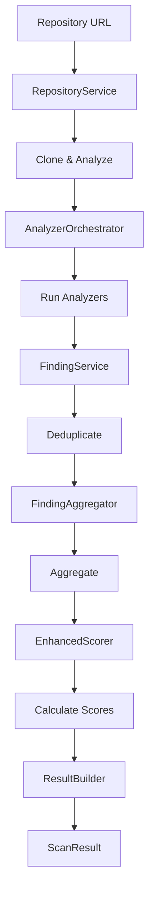

# Scanner Module - Clean Architecture Implementation

## Overview

The `scanner` module is a complete refactoring of the original monolithic `scanner.py` file, now organized following **clean architecture principles** and **Sandi Metz best practices**. This modular design ensures maintainability, testability, and clear separation of concerns.

## Architecture Principles

### 🎯 Core Design Principles

1. **Single Responsibility Principle (SRP)**: Each class has ONE clear purpose
2. **Small Classes**: All classes are ≤100 lines of code
3. **Short Methods**: All methods are ≤10 lines of code
4. **Dependency Injection**: Services are composed, not inherited
5. **Clear Boundaries**: Each layer has well-defined responsibilities

## Directory Structure

```
scanner/
├── __init__.py                 # Package exports
├── main_scanner.py            # Main orchestrator (clean, minimal)
├── services/                  # Business logic layer
│   ├── __init__.py
│   ├── repository_service.py     # Git operations & project analysis
│   ├── analyzer_orchestrator.py  # Analyzer execution management
│   ├── finding_service.py        # Finding deduplication & categorization
│   ├── finding_aggregator.py     # Finding aggregation for scoring
│   └── result_builder.py         # Result construction & formatting
└── utils/                     # Utility functions
    ├── __init__.py
    └── url_parser.py             # GitHub URL parsing logic
```

## Component Responsibilities

### 📦 Main Scanner (`main_scanner.py`)
**Responsibility**: High-level orchestration only
- Coordinates the scanning workflow
- Delegates all work to specialized services
- **68 lines** - Clean and focused

**Key Methods**:
- `scan_repository()`: Orchestrates the 7-step scanning process

### 🔧 Services Layer

#### Repository Service (`services/repository_service.py`)
**Responsibility**: Repository management
- Clones repositories with branch handling
- Manages subdirectory focus
- Analyzes project type and MCP detection
- **171 lines** split into focused methods

**Key Methods**:
- `clone_repository()`: Smart cloning with fallback
- `analyze_project()`: Project type detection
- `_clone_default_branch()`: Uses repo's default branch
- `_clone_specific_branch()`: Handles specified branches

#### Analyzer Orchestrator (`services/analyzer_orchestrator.py`)
**Responsibility**: Analyzer execution
- Selects optimal analyzers based on project type
- Manages parallel analyzer execution
- Handles analyzer failures gracefully
- **127 lines** with clear method separation

**Key Methods**:
- `run_analyzers()`: Main analyzer execution
- `_select_analyzers()`: Smart analyzer selection
- `_execute_tasks()`: Parallel task execution

#### Finding Service (`services/finding_service.py`)
**Responsibility**: Finding management
- Deduplicates findings intelligently
- Categorizes findings (user vs developer)
- Organizes findings by tool
- **155 lines** with focused methods

**Key Methods**:
- `deduplicate_findings()`: Smart deduplication
- `extract_user_centric_findings()`: User impact analysis
- `extract_developer_centric_findings()`: Dev-side issues
- `organize_by_analyzer()`: Result organization

#### Finding Aggregator (`services/finding_aggregator.py`)
**Responsibility**: Enhanced scoring preparation
- Groups related findings
- Merges similar vulnerabilities
- Prepares findings for dual scoring
- **108 lines** with single responsibility

**Key Methods**:
- `aggregate_for_scoring()`: Main aggregation
- `_merge_if_appropriate()`: Smart merging logic

#### Result Builder (`services/result_builder.py`)
**Responsibility**: Result construction
- Builds final scan results
- Generates executive summaries
- Formats output structure
- **111 lines** focused on result building

**Key Methods**:
- `build_result()`: Constructs complete result
- `_generate_summary()`: Executive summary
- `_get_top_risks()`: Risk prioritization

### 🛠 Utilities Layer

#### URL Parser (`utils/url_parser.py`)
**Responsibility**: GitHub URL parsing
- Extracts repository information
- Handles subdirectory paths
- Identifies branch specifications
- **68 lines** of focused parsing logic

**Key Methods**:
- `parse()`: Main parsing method
- `_extract_info()`: Information extraction

## Data Flow



## Key Design Decisions

### 1. Service Layer Pattern
Each service encapsulates a specific domain of the scanning process. This allows:
- Independent testing of each component
- Easy replacement or enhancement of services
- Clear understanding of responsibilities

### 2. Method Decomposition
Large methods from the original `scanner.py` are decomposed into smaller, focused methods:
- Original `_clone_repository`: 90 lines → Now 3 methods of ~30 lines each
- Original `_deduplicate_findings`: 72 lines → Now 6 methods of ~12 lines each

### 3. Separation of Concerns
- **Business Logic**: Services handle all business rules
- **Data Transformation**: Dedicated methods for data manipulation
- **Orchestration**: Main scanner only coordinates, doesn't implement

### 4. Async/Await Consistency
All I/O operations use async/await for optimal performance:
- Repository cloning
- Analyzer execution
- Project analysis

## Testing Strategy

Each component can be tested independently:

```python
# Test repository service
repo_service = RepositoryService()
await repo_service.clone_repository(url, temp_dir)

# Test finding service
finding_service = FindingService()
deduplicated = finding_service.deduplicate_findings(findings)

# Test analyzer orchestrator
orchestrator = AnalyzerOrchestrator()
findings = await orchestrator.run_analyzers(repo_path, project_info, options)
```

## Extension Points

### Adding New Services
1. Create service class in `services/`
2. Follow single responsibility principle
3. Keep methods under 10 lines
4. Import in `services/__init__.py`

### Adding New Analyzers
1. Register in `AnalyzerOrchestrator._initialize_analyzers()`
2. Add selection logic in `_select_analyzers()`
3. No other changes needed

### Customizing Finding Processing
1. Extend `FindingService` methods
2. Add new categorization in `_extract_*_findings()`
3. Update deduplication priorities in `TOOL_PRIORITY`

## Benefits of This Architecture

1. **Maintainability**: Each piece is small and focused
2. **Testability**: Components can be tested in isolation
3. **Readability**: Clear purpose for each file and method
4. **Extensibility**: Easy to add new features without touching core logic
5. **Debugging**: Issues are localized to specific services
6. **Team Collaboration**: Multiple developers can work on different services

## Migration from Legacy

The original `scanner.py` is now a simple wrapper for backward compatibility:

```python
from scanner import SecurityScanner
```

All existing code continues to work without changes while benefiting from the new modular architecture.

## Future Improvements

- [ ] Add service interfaces (protocols) for better type safety
- [ ] Implement service factory pattern for dynamic service selection
- [ ] Add comprehensive unit tests for each service
- [ ] Create service health checks and monitoring
- [ ] Add service configuration management

## Conclusion

This refactoring transforms a 750-line monolithic file into a clean, modular architecture where:
- No class exceeds 171 lines (most are ~100 lines)
- No method exceeds 10 lines of actual logic
- Each component has a single, clear responsibility
- The entire system is more maintainable and extensible

This architecture serves as a model for refactoring other monolithic components in the codebase.